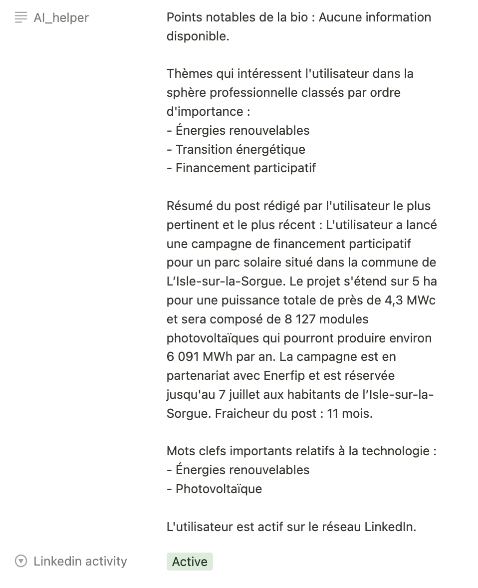

# notion_openai_enrich
Enrich Notion fields with OpenAI analysis.
This is a small hack that parse one notion DB for clients with linkedin url to enrich these clients with relevant sumed-up information (taken from OpenAI analysis with GPT-3.5-tubo).

The idea is to be able to get a client's relevant linkedin activities at a glance within notion.

Is this client active on linkedin?
what's his/her key interests?
What's he got published recently?

Having a minimum of context is key to being able to address clients/prospects professionally while keeping the pace.
## ⚠ Still heavy WIP

# Pre-requisites
- Notion DB with an integration able to read and write to your specific DB (more information here https://developers.notion.com/docs/create-a-notion-integration)
- Account on Rapid API (I use freshdata)
- Account on OpenAI
- Python3.10


# Install
One has to setup a few details prior to installing.
I use the following Rapid API https://rapidapi.com/freshdata-freshdata-default/api/fresh-linkedin-profile-data in order to fetch profile information and interactions (like comments, posts, reactions).

You'll also need to create an OpenAI account.

Your notion DB should have a field with "linkedin_url" :
```
client = {
             "name" : name,
             "linkedin_url" : linkedin,
             "page_id" : page_id,
        }
```
It also should have 2 other fields :
- One for linkedin activity which is a select
- The other for storing the information returned by openAI



You need to setup your keys in a .env file (not versioned for obvious reasons)

Best is to create a virtual env (conda or venv), then :
```
pip install -r requirements.txt
```